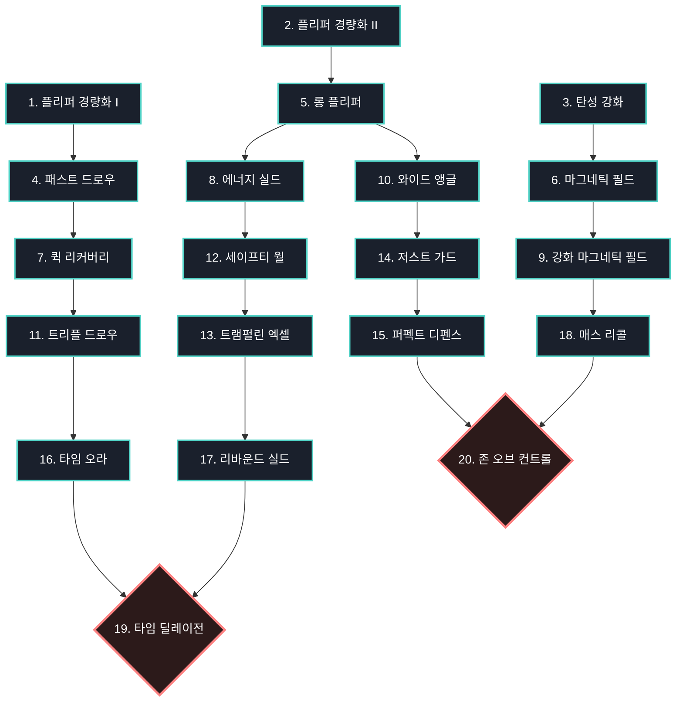
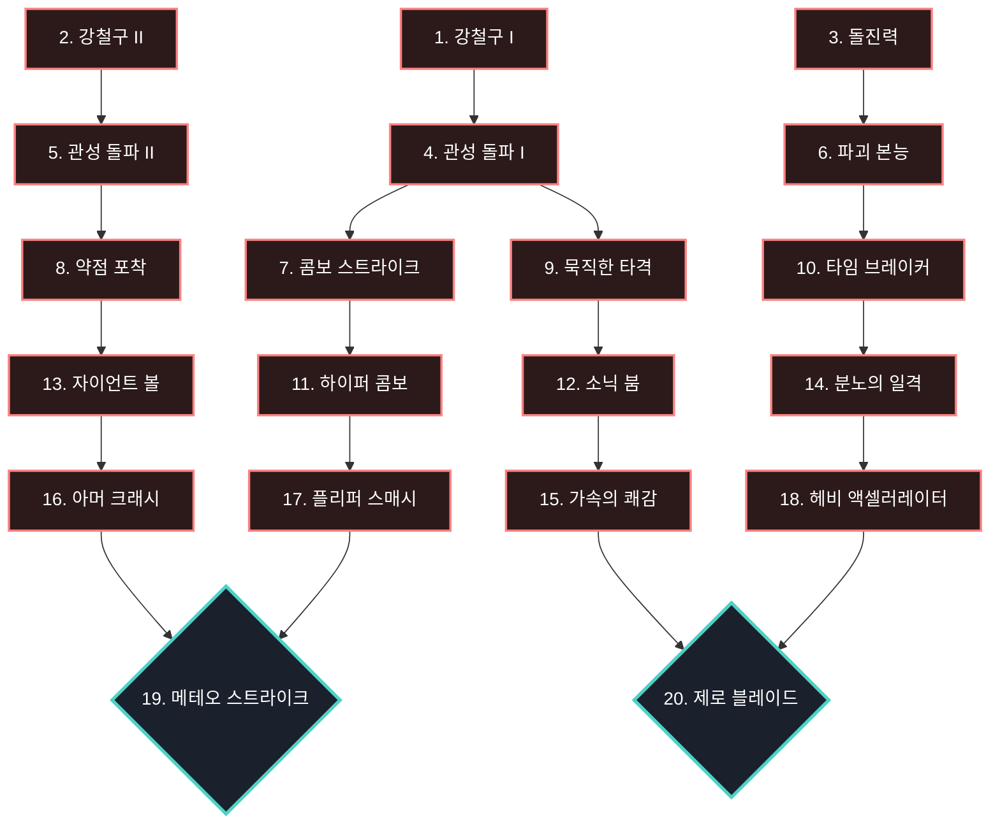
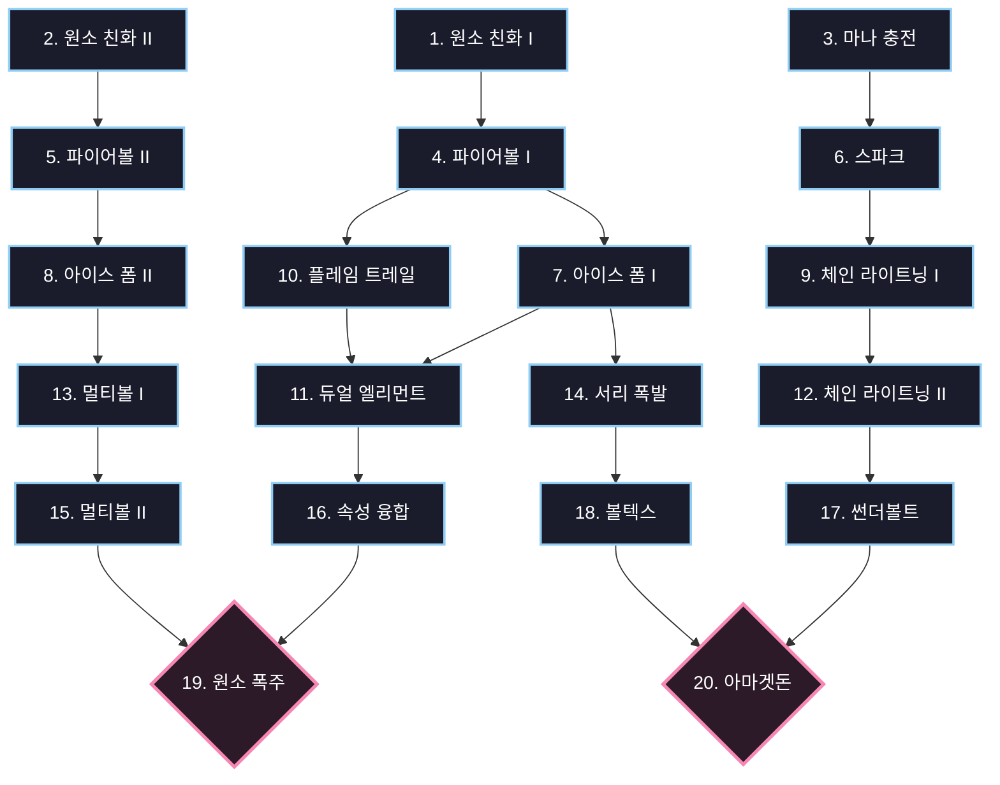

# RPG 핀볼 스킬 트리 다이어그램

`Skill_Tree_Formulas.md`의 연관관계를 바탕으로 시각화한 스킬 트리 구조입니다. 화살표 방향을 통해 각 스킬이 어느 티어로 연결되는지 한눈에 확인할 수 있습니다.

## 🟢 분기 1: 제어의 길 (Path of Control)

## 🔴 분기 2: 파괴의 길 (Path of Destruction)

## 🔵 분기 3: 원소의 길 (Path of Elements)

