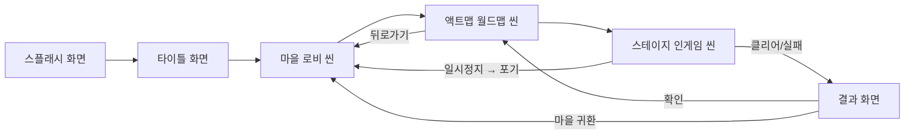
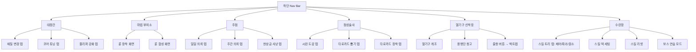
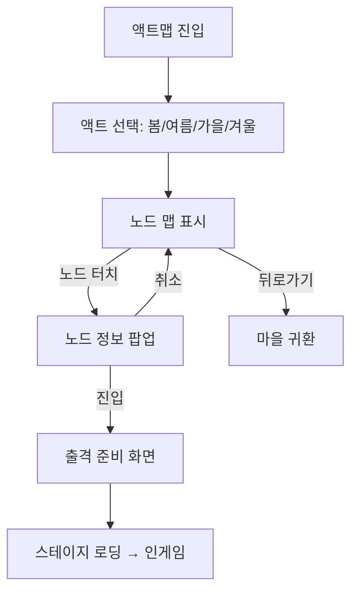
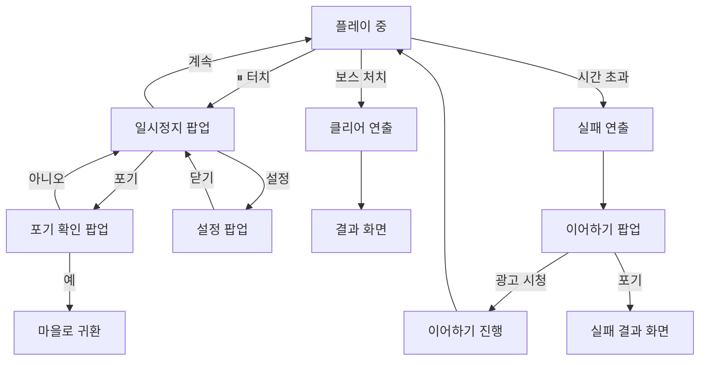

# RPG 핀볼 UI/UX 플로우 차트

게임의 씬 전환, 화면 흐름, 팝업 구조를 정의하는 문서입니다.

---

## 1. 전체 씬 전환 흐름



---

## 2. 타이틀 화면

| 요소 | 동작 |
|---|---|
| **터치하여 시작** | 세이브 데이터 존재 시 → 마을 로비 씬 진입 |
| | 세이브 데이터 없음 시 → 신규 게임 (Act 1 튜토리얼 직행) |
| **설정 버튼** | 설정 팝업 표시 (사운드, 그래픽, 계정 연동) |
| **크레딧 버튼** | 제작진 정보 표시 |

---

## 3. 마을 (로비 씬) 화면 흐름

### 하단 네비게이션 바 구조

```
┌─────────────────────────────────────┐
│         [배경 일러스트 + NPC]         │
│                                     │
│     (선택된 시설의 UI가 표시됨)        │
│                                     │
├──┬──┬──┬──┬──┬──┬──────────────────┤
│🔨│🔮│🍺│⭐│🎈│⚔️│    하단 Nav Bar    │
│대│마│주│점│열│수│                    │
│장│탑│점│성│기│련│                    │
│간│  │  │술│구│장│                    │
└──┴──┴──┴──┴──┴──┴──────────────────┘
```

### 시설별 화면 전환



---

## 4. 액트맵 (월드맵 씬) 화면 흐름



### 출격 준비 화면 (스테이지 진입 직전)

| 표시 정보 | 설명 |
|---|---|
| 스테이지 번호 및 유형 | "Act 1 - Stage 12 (일반 전투)" |
| 권장 레벨 | "권장 Lv.10" (미달 시 ⚠️ 경고) |
| 적용 중인 스테이지 특성 | "🔥 쾌속전" 등 (해당 시) |
| 장착 타로카드 | 3슬롯 확인/교체 |
| 소지 소모품 | 2슬롯 확인/교체 |
| 현재 재질/코어/플리퍼 | 장비 요약 표시 (변경은 마을에서만) |
| 스킬 덱 | 4슬롯 확인 (변경은 마을에서만) |
| **[출격] 버튼** | 스테이지 진입 |
| **[돌아가기] 버튼** | 노드 맵으로 복귀 |

---

## 5. 스테이지 (인게임 씬) 화면 흐름

### 인게임 HUD 레이아웃

```
┌─────────────────────────────────┐
│ [⏸] [⏱180초]  [💰1,234]  [⭐S] │  ← 상단 HUD
│                                 │
│     (게임 플레이 영역)            │
│                                 │
│          [32 COMBO!]            │  ← 콤보 카운터
│                                 │
│ ┌────┐                         │
│ │마나│ ████████░░ 75/100        │  ← 마나 게이지
│ └────┘                         │
│ ┌──┬──┬──┬──┐                  │
│ │🔥│❄️│⚡│💀│  스킬 덱 (4칸)    │  ← 하단 스킬 바
│ └──┴──┴──┴──┘                  │
│ ┌──┬──┐                        │
│ │🛡️│⏳│  소모품 (2칸)           │  ← 소모품 바
│ └──┴──┘                        │
└─────────────────────────────────┘
```

### 인게임 팝업 흐름



### 일시정지 시스템 (모바일 필수)

| 트리거 | 동작 |
|---|---|
| ⏸ 버튼 터치 | 게임 `Time.timeScale = 0`, 일시정지 팝업 |
| 전화 수신 / 앱 백그라운드 전환 | 자동 일시정지 (`OnApplicationPause`) |
| 알림 터치로 앱 이탈 | 자동 일시정지 |
| **타이머 처리** | 일시정지 중 타이머 완전 정지. 재개 시 정확히 이어서 진행 |
| **물리 상태 보존** | 공 위치·속도·회전, 몬스터 상태, 기믹 상태 모두 직렬화 가능하도록 설계 |

---

## 6. 결과 화면

### 클리어 결과

| 표시 정보 | 설명 |
|---|---|
| 등급 (S/A/B) | 남은 시간 비율 기반 |
| 클리어 시간 | "120.5초 / 180초" |
| 총 콤보 | 최대 콤보 수 표시 |
| 획득 XP | 등급 보너스 포함 |
| 획득 골드 | 등급 보너스 포함 |
| 획득 아이템 | 드랍된 재료·룬·코어 조각 등 |
| **[다음 스테이지] 버튼** | 다음 노드로 바로 진행 |
| **[액트맵] 버튼** | 액트맵으로 복귀 |
| **[마을] 버튼** | 마을로 귀환 |

### 실패 결과 (이어하기 거부 시)

| 표시 정보 | 설명 |
|---|---|
| "시간 초과" 문구 | 실패 사유 표시 |
| 획득 XP | 정상 수치의 30% (부분 보상) |
| 획득 골드 | 정상 수치의 30% |
| **[재도전] 버튼** | 같은 스테이지 즉시 재도전 (시드 변경) |
| **[액트맵] 버튼** | 액트맵으로 복귀 |

### 이어하기 시스템 상세

| 항목 | 내용 |
|---|---|
| **발동 조건** | 제한 시간 0초 도달 시 |
| **이어하기 방법** | 광고 시청 (리워드 광고) |
| **일일 제한** | 3회/일 |
| **이어하기 시 복원 상태** | 제한 시간 +30초 추가, 마나 100%로 충전, 공은 리스폰 위치에서 재시작, 콤보 0으로 리셋, 스킬 쿨타임 전체 초기화, 보스 HP/상태는 유지(회복 없음) |
| **등급 페널티** | 이어하기 사용 시 최대 등급 C로 제한 |

---

## 7. 공통 팝업 시스템

| 팝업 유형 | 사용처 | 닫기 방식 |
|---|---|---|
| **확인 팝업** | 구매, 강화, 리셋 등 재화 소모 행동 | [확인] / [취소] |
| **알림 팝업** | 레벨업, 해금, 업적 달성 | [확인] 또는 자동 닫힘(3초) |
| **보상 팝업** | 의뢰 완료, 도감 달성, 타로카드 획득 | [확인] (아이템 연출 후) |
| **가이드 팝업** | 신규 기믹 첫 조우, 시설 첫 방문 | [확인] + 다시 보지 않기 체크박스 |
| **설정 팝업** | BGM/SFX 볼륨, 그래픽 품질, 계정 연동 | [닫기] |

---

## 8. UI 용어 통일 표준

UI 텍스트와 코드 식별자에서 사용하는 용어를 다음과 같이 통일합니다. 다른 설계 문서와 혼용 시 이 표를 우선합니다.

| 표시 용어 (UI 텍스트) | 코드 식별자 | 비표준 표기 (사용 금지) |
|---|---|---|
| **마나** | `mana`, `manaGauge`, `manaCost` | MP, Mana Point, 마나 포인트 |
| **콤보** | `combo`, `comboCount` | Combo Count, 연계 |
| **제한 시간** | `remainingTime`, `timeLimit` | TIME, 잔여시간 |
| **골드** | `gold` | G, Gold Coin, 금화 |
| **경험치** | `xp`, `currentXP` | EXP, Experience |
| **스킬 포인트** | `sp`, `totalSP` | SP만 단독 표기 시 한글 병기 권장 |
| **보스의 영혼** | `bossSoul` | Soul, 영혼석 |
| **마나 결정** | `manaCrystal` | Crystal, 결정석 |
| **타로카드** | `tarotCard` | 카드, Card, 운명 카드 |

**HUD 표시 규칙**:
- 게이지·수치 표시는 **한글 라벨 우선** ("마나 75/100", "제한 시간 142초").
- 약어 표기는 좁은 공간에서만 허용하되, 첫 등장 시 가이드 팝업에서 풀어쓰기.
- 콤보 카운터의 "32 COMBO!"는 영문 그대로 유지 (시각 효과 강조용 예외).

---

## 9. 참조 문서

| 항목 | 참조 문서 |
|---|---|
| 마을 시설 상세 기능 | `Game_Design_Spec.md` 섹션 3 |
| 인게임 스킬/마나 시스템 | `Game_Design_Spec.md` 섹션 2 |
| 등급 시스템 | `Game_Design_Spec.md` 섹션 9 |
| 스테이지 유형 | `Procedural_Stage_Gen.md` 섹션 6 |
